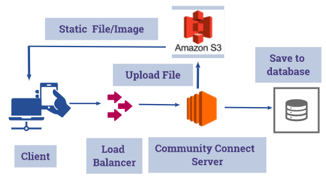
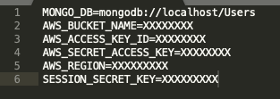

# Community Connect: A Mock Social Media Platform to Study Online Behavior

Community Connect is a social media platform for conducting controlled experiments of human behavior, created with the goal of facilitating research on data collected through controlled experiments on social networks. The key distinguishing feature of Community Connect is the ability to control the visibility of user posts based on the groups they belong to, allowing careful and controlled investigation into how information propagates through a social network. We release this platform as a resource to the broader community, with the goal of faciliating research on data collected through controlled experiments.

## User Interface for Community Connect


## System Architecture



## Web Sequence Diagram


## Features
- Sign up using unique_id for each user. 
- Unique user avatar for every user.
- Tweet and Retweet feature like Twitter.
- Like and Reply on Tweets and Retweets.
- Image and URL uploads.
- Data Abstraction on the basis of groups. 
- Emojis.
- Notifications.

## Getting Started

These instructions will get you a copy of the project up and running on your local machine for development and testing purposes. See deployment for notes on how to deploy the project on a live system.

### Prerequisites and Installation

Clone the repo locally then install all the dependencies using [NPM](https://npmjs.org/)

```bash
$ git clone https://github.com/Souravroych/Mock-social-network-master-updated.git
$ cd Mock-social-network-master-updated
$ npm install
```

## Requirements

- [Node.js](https://nodejs.org)
  - expressjs [ExpressJS HTTP middleware](https://npmjs.org/package/express)
  - ejs [Embedded JavaScript templates](https://npmjs.org/package/ejs)
- [MongoDB](http://mongodb.org)

Before starting, please make sure you have Node and NPM installed. <br>
For installing Node, follow instructions on this link --> [Installing NodeJS](https://nodejs.org/en/download/) <br><br>

Make sure to install and configure MongoDB on server.

Also make sure to install Install MongoDB Community Edition on your machine.
[MongoDB](https://docs.mongodb.com/manual/administration/install-community/)

You can also install mongoDB compass to explore and manage MongoDB data easily
[MongoDB-Compass](https://www.mongodb.com/products/compass)


You can verify the installation by running following commonds on terminal or cmd
`npm -v`
`node -v`


Doing a `npm install` in the project folder should install all the dependencies and create a folder called `node_modules`. <br>

## Populating the database using the Excel

- Users are prepopulated using the excel file referenced above. 
- The name of the User is in column B **"User name"**. 
- The unique ID for each user needs to entered in column C **"user_id"**, this is the id string using which users Sign-up for the very first time to create their profile. 
- Email in column D holds the **email-ids** for every user. 
- **Group** in column E is used to assign the users to their individual groups. (Users who are assigned in multiple groups are **Bridge Users**)

## Changing the .env file


Before running, we need to add `AWS_BUCKET_NAME`, `AWS_ACCESS_KEY_ID`, `AWS_SECRET_ACCESS_KEY`, `AWS_REGION` & `SESSION_SECRET_KEY`

## For Local

Clone the repo locally then install all the dependencies using [NPM](https://npmjs.org/)

```bash
$ git clone https://github.com/Souravroych/Mock-social-network-master-updated.git
$ cd Mock-social-network-master-updated
$ brew services restart mongodb-community
$ npm install
$ npm start
```

## For EC2

- Create your EC2 instance using your Amazon AWS account. [EC2](https://docs.aws.amazon.com/efs/latest/ug/gs-step-one-create-ec2-resources.html)
- Create your S3 container. [S3](https://docs.aws.amazon.com/quickstarts/latest/s3backup/step-1-create-bucket.html)
- Install the node.js dependencies in the Amazon Elastic Compute Cloud Instance.
  - Connect to your Linux instance as ec2-user using SSH
  - npm install downloads a package and it's dependencies. npm install can be run with or without arguments. When run without arguments, npm install downloads  dependencies defined in a package. json file and generates a node_modules folder with the installed modules.
  - Install MongoDB in the EC2 Operating system.
  - Install pm2 (PM2 is a production process manager for Node.js applications with a built-in load balancer. It allows you to keep applications alive forever, to reload them without downtime and to facilitate common system admin tasks)
  ```bash
  $ npm install pm2 -g
  ```
  - Start the application using
  ```bash
  $ pm2 start index.js
  ```
  (Your app is now daemonized, monitored and kept alive forever)


## Folder Structure 

To start off please note that all third party dependencies are managed through NPM and a package.json file.
NPM is the defualt package management system for javascript programming and it aids in package installation, dependency management and version management.

`/model` contains all the ORM or the Virtual object database (specifically called schemas in mongoose). <br />
`/views` contains all the view templates (we have used Embedded javascript templating engine for node.js). <br />
`/style` contains all the style sheets or the css files used for stylisation including colour, layout and fonts. <br />
`/routes` contains all the server side functions for different modules or areas of the application. <br />
`/middleware` contains the functions which have access to request object, response object and the next function in applications request response cycle. <br />
`/controller` contains all the major express routes seprated by major sections.  <br />
`/assets` contains all the images, some client side JS files and style sheets. <br />


## Data Storage and Retreival

### Schema for Backend

#### Users

| *Field*                                               | _id                                            | user_id                                        | username                  | password                  | name                      | bio                       | location                  | Email ID                  | created_at                | profile_pic               | group_id                         |
|-------------------------------------------------------|------------------------------------------------|------------------------------------------------|---------------------------|---------------------------|---------------------------|---------------------------|---------------------------|---------------------------|---------------------------|---------------------------|----------------------------------|
| *Function*                                            | *primary_key, system generated, do not change* | *generate based on demo, experiment condition* | *assign default or empty* | *assign default or empty* | *assign default or empty* | *assign default or empty* | [assign default or empty] | *assign default or empty* | *assign default or empty* | *assign default or empty* | *pre-populate*                   |
| *Data Type*                                           | *ObjectId*                                     | *string*                                       | *string*                  | *private password*        | *string*                  | *string*                  | *string*                  | *string*                  | *datetime*                | *URL*                     | *list of strings*                |
| *Example of how this will look at setup*              | \<empty\>                                      | jd_c1_06112020                                 | \<empty\>                 | \<empty\>                 | John Doe                  | \<empty\>                 | \<empty\>                 | john.doe&#8203;@gmail.com | \<empty\>                 | \<empty\>                 | [Blue] ([Blue, Red] if multiple) |
| *Example of how this will look when the experiment is underway* | x1y2                                           | jd_c1_06112020                                 | john_doe                  | john_doe                  | John Doe                  | hello                     | Charlotte                 | john.doe&#8203;@gmail.com | TIMESTAMP                 | [link to profile pic]     | [Red] ([Blue, Red] if multiple)  |

### Groups

| *Field*                                               | group_id                                       | group_name                                                            | group_desc                          |
|-------------------------------------------------------|------------------------------------------------|-----------------------------------------------------------------------|-------------------------------------|
| *Function*                                            | *primary key, system_generated, do not change* | *experiment-assigned group name, same as group info from Users table* | *field to store group descriptions* |
| *Data Type*                                           | *ObjectId*                                     | *list of strings*                                                     | *string*                            |
| *Example of how this will look at setup*              | a1b2                                           | [Blue, Red]                                                           | All bridge users                    |
| *Example of how this will look when the experiment is underway* | a1b2                                           | [Blue, Red]                                                           | All bridge users                    |

### Feeds

| *Field*                                                          | _id                                            | user_id                                          | body                | created_at          | liked_by                                       | like_count              | retweet_count              | reply_count                                    | quote_count                                | post_type                                                                                     | parent_id                                                                                                                     | conversation_id                                                                                                                                 | mentions                                                                                                                               | visible_to                                                                                    |
|------------------------------------------------------------------|------------------------------------------------|--------------------------------------------------|---------------------|---------------------|------------------------------------------------|-------------------------|----------------------------|------------------------------------------------|--------------------------------------------|-----------------------------------------------------------------------------------------------|-------------------------------------------------------------------------------------------------------------------------------|-------------------------------------------------------------------------------------------------------------------------------------------------|----------------------------------------------------------------------------------------------------------------------------------------|-----------------------------------------------------------------------------------------------|
| *Function*                                                       | *primary key, system generated, do not change* | *copy from user_id of person taking this action* | *created with post* | *created with post* | *maintains list of people who liked this post* | *updates post is liked* | *updates post is reposted* | *updates when a reply is posted on this post*  | *updates post is reposted with comment*    | *created with post based on how it was created - can be “tweet”, “retweet”, “reply”, “quote”* | *if post_type is “tweet”, this is empty, otherwise this is the _id of the post on which action was taken to create this post* | *if post_type is “tweet”, this is copy of _id, otherwise this is the conversation_id of the post on which action was taken to create this post* | *if another user was mentioned, add their user_id from Users table here; also logically these can only be users in this user’s groups* | *mark this post visible to the user’s groups, then update based on interactions on this post* |
| *Data Type*                                                      | *ObjectId*                                     | *string*                                         | *string*            | *datetime*          | *list of strings*                              | *number*                | *number*                   | *number*                                       | *number*                                   | *string*                                                                                      | *string*                                                                                                                      | *string*                                                                                                                                        | *list of strings*                                                                                                                      | *list of strings*                                                                             |
| *Example of how this will look at setup*                         | \<empty\>                                      | \<empty\>                                        | \<empty\>           | \<empty\>           | \<empty\>                                      | \<empty\>               | \<empty\>                  | \<empty\>                                      | \<empty\>                                  | \<empty\>                                                                                     | \<empty\>                                                                                                                     | \<empty\>                                                                                                                                       | []                                                                                                                                     | \<empty\>                                                                                     |
| *Example of how this will look when someone posts*               | 123                                            | x1y2                                             | hello               | TIMESTAMP           | []                                             | 0                       | 0                          | 0                                              | 1 *(became 1 when x2y3 quoted this tweet)* | tweet                                                                                         | \<empty\>                                                                                                                     | 123                                                                                                                                             | []                                                                                                                                     | [Blue]                                                                                        |
| *Example of how this will look when someone quotes post 123*     | 234                                            | x2y3                                             | world               | TIMESTAMP           | []                                             | 0                       | 0                          | 1 *(became 1 when x3y4 replied on this tweet)* | 0                                          | quote                                                                                         | 123 *(copied from _id of post which was quoted)*                                                                              | 123 *(copied from conversation_id of post which was quoted)*                                                                                    | []                                                                                                                                     | [Blue]                                                                                        |
| *Example of how this will look when someone replies on post 234* | 356                                            | x3y4                                             | everyone            | TIMESTAMP           | []                                             | 0                       | 0                          | 0                                              | 0                                          | reply                                                                                         | 234 *(copied from _id of post on which reply was made)*                                                                       | 123 *(copied from conversation_id of post which was quoted)*                                                                                    | []                                                                                                                                     | [Blue]                                                                                        |

### How to Retrieve Data
1. [Dumping MongoDB data](https://docs.mongodb.com/manual/reference/program/mongodump/)
2. [Backing up and restoring data from MongoDB dump](https://docs.mongodb.com/manual/tutorial/backup-and-restore-tools/)
3. [For python - using pymongo to read data from MongoDB](https://pymongo.readthedocs.io/en/stable/)
3. [For R - using the 'mongolite' R package to read MongoDB data](https://jeroen.github.io/mongolite/connecting-to-mongodb.html)

### Browser Support

-   Chrome (84.0.4147)
-   Firefox (78.0)
-   Safari (14.x)
-   Internet Explorer(11.0)


## Contributors

-   [Sourav Roy Choudhury](https://github.com/Souravroych)
-   [Khyati Mahajan](https://github.com/khyatimahajan)
-   [Samira Shaikh](https://github.com/sshaikh2)

## License
This project is licensed under the MIT License - see the [LICENSE.md](LICENSE.md) file for details
